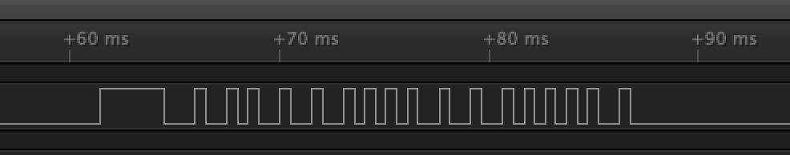
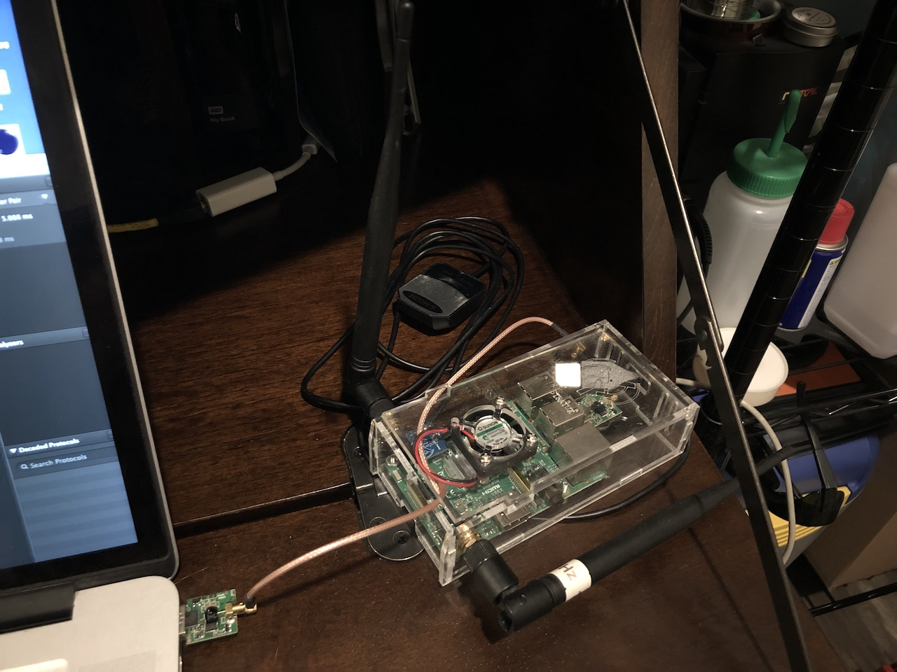
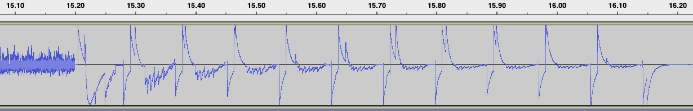
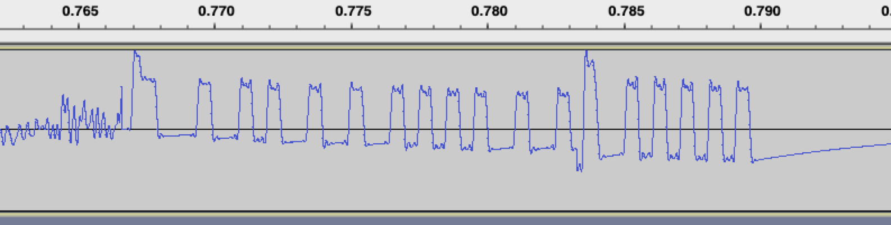

# Hacking Christmas lights with spare avionics and pancreas parts

## Background

A few years ago I bought [these LED lights](https://www.target.com/p/philips-25ct-christmas-led-16-functions-faceted-c9-string-lights-color-changing/-/A-52347189)
for the holiday season. They're "smart" LEDs - each one is controlled individually, so the string of lights can do various blinking and rainbow effects.
The lights are controlled by an RF remote that lets you select between the different effects and turn them on and off. Fairly common these days.

Lately I've been on a home automation kick, and so I started thinking about how to get these lights to turn on and off in an
automated way, like on at dusk and off at dawn. One option would be a "smart plug" with a relay that can control the power of
an attached device. But that adds an extra cost, plus most smart plugs are too big to fit into the weatherproof
outlet box on my porch. These lights can turn themeselves off and on anyway - can't we just use that?

## Reverse Engineering

I started by looking at the [FCC filing](https://fccid.io/N9STY-R-434) for the remote control. The
[internal photos](https://fccid.io/N9STY-R-434/Internal-Photos/Internal-Photos-3003636) show a typical
ultra-low-cost RF remote - an IC connected to the various button pads, some RF circuitry, an antenna,
and a coin cell. Usually the FCC filings include a product's user manual (which, by
the way, is handy for looking up products that otherwise have no public documentation), but the
["manual"](https://fccid.io/N9STY-R-434/Users-Manual/User-Manual-3003641) for this remote control had some extra text:

> MCU control data launch working frequency for 434.2 MHZ, By using PT4455 crystal
> As a fundamental, the frequency offset can be reduced to the minimum. In the operation of the 250-450MHZ band,
> the working voltage can output +10dBm power 3.0V, it is suitable for low voltage applications. Peripheral parts at least,
> can reduce the PCB area, let the end product more play space in the shape and the package features SOT-6, built-in crystal oscillator!
> The product specification
> 1. Communication: OOK/ASK radio frequency
> 2. Working frequency: 434.2 MHZ
> 3. Frequency stability: + 75 KHZ
> 4. The maximum data rate: 20kbps
> 5. Static current: than 0
> 6. Emission current: 19MA
> 7. Working voltage: DC2.2-3.6 V
> 8. The transmission distance; 50 m

That's not about the remote... it's about the RF chip inside! There's a lot of information there. The board has two ICs, one 14-pin
and one 6-pin; the text above refers to a SOT-6 package, so that part must be the RF modulator. The modulation is OOK/ASK, basically very
simple AM. What to do next? Take it apart!

The construction is very simple. The back shell of the case is injection-molded plastic. The PCB screws into it, and the front surface
is just a sticker applied over the top of the PCB.Unfortunately I forgot to take photos of the board before reassembling it, but you can
find some grainy photos in the [internal photos](https://fccid.io/N9STY-R-434/Internal-Photos/Internal-Photos-3003636) of the FCC filing.

I found that the two ICs are connected with a resistor divider, which I suspected was used to set the modulation depth of the
[ASK](https://en.wikipedia.org/wiki/Amplitude-shift_keying) modulation. I hooked up my Saleae logic analyzer to the output of the
14-pin IC, pressed a button, and saw this:



I tried a few other buttons as well. What struck me about the encoding is that it always had
the same number of pulses (18, including the long first one), and that after the first high
and low interval, every high pulse was 0.5 milliseconds long. The low pulses, however, were
either 0.5 or 1.0 ms long. This is a coding scheme that I'm not familiar with; most simple
RF protocols use something like Manchester encoding, where each bit has a fixed time interval,
but this one is variable-length since each bit is 1.0 or 1.5 ms in total.

I decided to treat the initial high, low, high cycles as a pilot, and then interpret the signal
as follows: 1ms low followed by 0.5ms high is a 1 bit; 0.5ms low followed by 0.5ms high is a
0 bit. Interpreted that way, the signal above is a 16-bit word, `1011100011100001`.

I still don't know if there's a name for this encoding and if it's commonly used. If you've seen
it before, please let me know.

What next? Well, there's only one power button on the remote and it toggles the LEDs on and
off. That's not ideal for automation, since one dropped message could cause the controller to
think the LEDs are off when they're actually on, and vice versa. I figured I'd start repeating
messages and then explore the message space (65536 possible messages) to see if the device happens
to support separate on and off messages.

## Radio

But how to send this data myself? Software defined radios in this frequency range are fairly
common, and I considered buying something like a "YARD Stick One". But then I remembered that
I already had what I needed. I have type 1 diabetes, and for the past two years I've managed
my blood sugar with a systen called [Loop](https://github.com/LoopKit/Loop). Loop is just about
the closest thing there is today to an artificial pancreas. It's an app that runs on an iPhone
and reads blood sugar values over Bluetooth from a [Dexcom](https://www.dexcom.com/)
continuous glucose sensor. Based on those numbers, and me telling it about my meals, it remotely
controls my insulin pump as needed. The creators of Loop went to extreme lengths to
[reverse-engineer and reimplement](https://blog.usejournal.com/insulin-pumps-decapped-chips-and-software-defined-radios-1be50f121d05)
the radio protocols used by several popular insulin pump systems. Most pumps don't have
Bluetooth, so Loop uses a device called a [RileyLink](https://github.com/ps2/rileylink) to
talk to the pump.

I've been tinkering with manufacturing my own RileyLink-based devices and so I had a few prototypes
lying around. The insulin pump I use has a 433mhz radio interface - the same band as the lights!
Loop is an iOS app, but others in the diabetes-hacking space are also using RileyLinks for
their experimentation, and I knew there was a Python driver in another artificial-pancreas
component called [Omnipy](https://github.com/winemug/omnipy). So I grabbed Omnipy's driver,
put it on a Raspberry Pi, and hacked in what I thought would be an implementation of the
lights' radio protocol.

I ran the script, saw the LED on my Bluetooth interface board light up, and... nothing happened.

## Debugging

At this point I despaired a bit. Without a proper general-purpose radio interface I was flying
blind, and debugging seemed impossible. I knew about tools like [RfCat](https://github.com/atlas0fd00m/rfcat) and
started digging through parts bins looking for a dev board that could run the RfCat firmware,
but came up blank. Then I remembered my [Stratux](http://stratux.me/). A Stratux receives
[ADS-B](https://en.wikipedia.org/wiki/Automatic_dependent_surveillance_%E2%80%93_broadcast) signals
from nearby airplanes; it's meant to allow pilots (or aviation enthusiasts) to see the position
of nearby airplanes. Stratux's radio interface is the [RTL2832](https://www.amateur-radio-wiki.net/index.php?title=RTL2832)
chip. This part was originally designed for digital TV, but has debug modes that can send raw
samples to the computer - a software-defined radio. Perfect!

I tore apart the Stratux and hooked it up to my laptop.



[CubicSDR](https://cubicsdr.com/) let me see what my code was actually transmitting. I set it
to 434.2 MHz with AM modulation, started a capture, and ran my code. This produced a .wav file
which I loaded up with Audacity:



Uh oh. That looks nothing at all like what I saw on the board... To make sure my capture
setup was working correctly, I ran another capture and pressed the button on the remote again.
Here's what I got:



That looked familiar. So I knew that I was capturing the data I expected - the problem must
be with my code.

At this point I spent some time with the datasheet for the CC1110, used in the RileyLink design
as the sub-GHz radio transmitter. Eventually I found the problem: I was misconfiguring the transmit
power register. The Omnipod uses [FSK](https://en.wikipedia.org/wiki/Frequency-shift_keying)
modulation, a form of FM, where the transmitted data is at consistent power but varying frequency.
To send the ASK that I needed, I would have to separately configure the two power levels used for
1 and 0. Eventually, I was able to use my script to power off the lights!

But I could only power them off, not on. Huh?

## State Transitions

At this point I went back and compared the data I saw in the radio capture with the data
from the very first Saleae run. It didn't quite match. On a hunch, I started another SDR capture
and pressed and released the power button several times. Sure enough, it sent a different message
the first and second time. I copied those into the script, and as I hoped, one turned the lights
on and the other turned them off.

This was unexpected. I thought the state-keeping would be in the receiver, not the transmitter.
I wonder why they designed it that way?

## Finishing Touches

I'm already using [HomeBridge](https://github.com/nfarina/homebridge) on a Raspberry Pi to
link up a few other devices, so I decided to use it here too. The Omnipy code takes about 10
seconds to finish initializing the RileyLink, but commands are fast after that; so I wrapped
up my code with Python's `http.server.HTTPServer` and used
[homebridge-http-lightbulb](https://github.com/Supereg/homebridge-http-lightbulb) to control it.

Here's the relevant part of my HomeBridge config.json:

```
    {
      "accessory": "HTTP-LIGHTBULB",
      "name": "Christmas Lights",
      "onUrl": "http://localhost:8999/on",
      "offUrl": "http://localhost:8999/off",
      "statusUrl": "http://localhost:8999/state",
      "statusPattern": "on"
    }
```

## Future Work

The lights have 16 different out-of-the-box color change modes. I haven't yet sniffed
the sequence of messages sent by the mode button - hopefully I'll be able to reliably control
those too.
